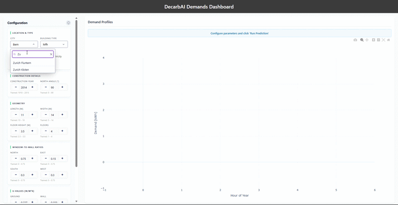

[](https://pypi.org/project/decarbai-demands)
[](https://pypi.org/project/decarbai-demands)

# DecarbAI Demands

Predicts 8760-hour heating, cooling, electricity, and DHW demand profiles for Swiss buildings using a per-city, per-building-type XGBoost + PCA ensemble, served through an interactive Dash dashboard.

## Demo



## Install

```bash
pip install decarbai-demands
```

Requires **Python 3.11+**.

## Model download

Model artifacts are not bundled in the package. On the first prediction for a given city
the package downloads `{city}.tar` (~100 MB) from a public S3 bucket and caches it at
`~/.cache/decarbai/models/`. Subsequent runs use the local cache.

## Run the dashboard

After installing the package, launch the dashboard with the bundled CLI:

```bash
decarbai-demands dashboard
```

Or, from a source checkout:

```bash
uv run python -m decarbai_demands.dashboard
```

Opens an interactive Dash UI at `http://127.0.0.1:8050/` for configuring a building and predicting its hourly heating, cooling, electricity, and DHW demand profiles.

## Repo structure

```
src/decarbai_demands/
├── schema.py              Pydantic InputData + the 17-feature ordered vector
├── model.py               XGBoost + PCA ensemble loader (Model + load_artifacts)
├── pipeline.py            run_pipeline: feeds InputData through the per-city models
├── dashboard/             Dash app (subpackage)
│   ├── app.py             create_app() + run_dashboard() + __main__
│   ├── layout.py          UI tree (header, form sections, panels, modal hookup)
│   ├── callbacks.py       Prediction, CSV download, live range validation, modal toggle
│   ├── styles.py          Style dicts shared across the UI
│   ├── constants.py       Cities, building types, demand types, form defaults
│   └── ranges.py          TRAINING_RANGES + the info-modal builder
└── model_cache.py         S3 download + local cache at ~/.cache/decarbai/models/
                           Layout: {country}/{city}/{building_type}/{demand}.zst
```

Heating and cooling each have their own `.zst` model file; DHW and electricity share `electricity_dhw.zst` (first 8760 values = DHW, next 8760 = electricity).

## Model training envelope

Predictions are most reliable when inputs lie within the ranges the model was trained on. Outside this envelope, the model extrapolates and confidence drops. The dashboard surfaces the same ranges inline next to each input and in the `ⓘ` info modal.

### Direct inputs

| Feature             | Min    | Max    |
| ------------------- | ------ | ------ |
| Width [m]           | 5.0    | 14.0   |
| Length [m]          | 10.0   | 19.0   |
| Floor Height [m]    | 2.5    | 3.5    |
| Number of Floors    | 1      | 4      |
| Construction Year   | 1918   | 2015   |
| North Angle [°]     | 0      | 90     |
| WWR (N / E / S / W) | 0.0    | 0.75   |
| U_Ground [W/m²K]    | 0.12   | 1.24   |
| U_Wall [W/m²K]      | 0.11   | 3.06   |
| U_Roof [W/m²K]      | 0.11   | 1.63   |
| U_Window [W/m²K]    | 0.78   | 5.67   |

### Derived features (computed from geometry)

| Feature                    | Min   | Max    |
| -------------------------- | ----- | ------ |
| Footprint [m²]             | 50.0  | 266.0  |
| Total Height [m]           | 2.5   | 14.0   |
| Volume [m³]                | 125.0 | 3724.0 |
| Envelope Area [m²]         | 175.0 | 1456.0 |
| Relative Compactness [-]   | 0.65  | 1.0    |
| Characteristic Length [m]  | 0.71  | 2.56   |
| Average WWR [-]            | 0.0   | 0.75   |
